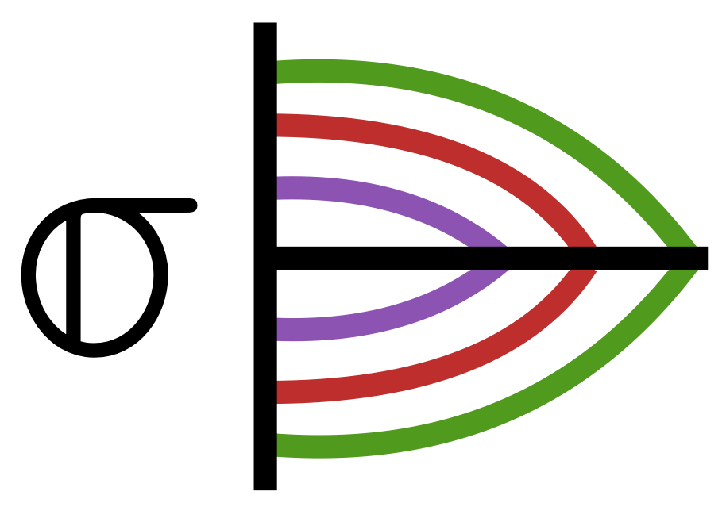

# SigmaRidgeRegression.jl



[](https://github.com/nignatiadis/SigmaRidgeRegression.jl/actions)
[](https://codecov.io/gh/nignatiadis/SigmaRidgeRegression.jl)


Automatically and optimally-tuned Ridge regression when the features may be partitioned into groups.

See the manuscript below for a theoretical description of the method.
>  Ignatiadis, Nikolaos, and Panagiotis Lolas. "Group-regularized ridge regression via
empirical Bayes noise level cross-validation." [arXiv:2010.15817](https://arxiv.org/abs/2010.15817) (2020+)

The folder `reproduction_code` in this repository contains code to reproduce the results of the paper.

## Installation
The package is available on the Julia registry (for Julia version 1.5) and may be installed as follows:

```julia
using Pkg
Pkg.add("SigmaRidgeRegression")
```

## Example usage

SigmaRidgeRegression.jl can be used alongside the [MLJ](https://github.com/alan-turing-institute/MLJ.jl) framework for machine learning in Julia.

```julia
using MLJ
using SigmaRidgeRegression
using Random

# Suppose we have three groups of features, each with n observations
# and 25, 50 and 100 features respectively
n = 400
Random.seed!(1)
p1 = 25 ; X1 = randn(n, p1)
p2 = 50 ; X2 = randn(n, p2)
p3 = 100; X3 = randn(n, p3)

# The signal in the regression of the coefficients across these groups varies
α1_sq = 4.0 ;  βs1 = randn(p1) .* sqrt(α1_sq / p1)
α2_sq = 8.0 ;  βs2 = randn(p2) .* sqrt(α2_sq / p2)
α3_sq = 12.0;  βs3 = randn(p3) .* sqrt(α3_sq / p3)

# Let us concatenate the results and create a response
X = [X1 X2 X3]
βs = [βs1; βs2; βs3]
σ = 4.0
Y = X*βs .+ σ .* randn(n)

# Let us make a `GroupedFeatures` object that describes the feature grouping
# !!NOTE!! Right now the features are expected to be ordered consecutively in groups
# i.e., the first p1 features belong to group 1 etc.
groups = GroupedFeatures([p1;p2;p3])

# Create MLJ machine and fit SigmaRidgeRegression:
sigma_model = LooSigmaRidgeRegressor(;groups=groups)
mach_sigma_model = machine(sigma_model,  MLJ.table(X), Y)
fit!(mach_sigma_model)

# How well are we estimating the true X*βs in mean squared error?
mean(abs2, X*βs .- predict(mach_sigma_model))  # 4.612726430034071

# In this case we may compare also to the Bayes risk
λs_opt = σ^2 ./ [α1_sq; α2_sq; α3_sq] .* groups.ps ./n
bayes = MultiGroupRidgeRegressor(;groups=groups, λs=λs_opt, center=false, scale=false)


mach_bayes = machine(bayes, MLJ.table(X), Y)
fit!(mach_bayes)
mean(abs2, X*βs .- predict(mach_bayes)) #4.356913540118585
```

### TODOs

* Fully implement the MLJ interface.
* Wait for the following MLJ issue to be fixed: https://github.com/alan-turing-institute/MLJBase.jl/issues/428#issuecomment-708141459, in the meantime this package uses type piracy as in the linked comment to accommodate a large number of features.